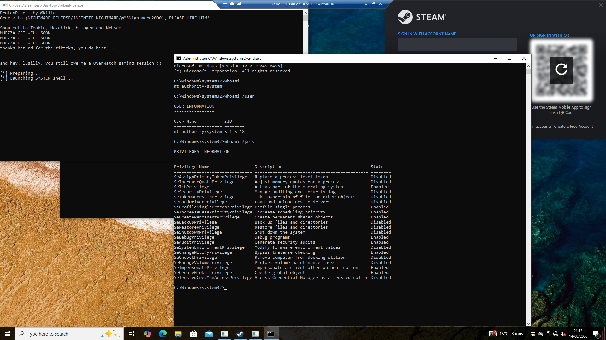

# BrokenPipe - Steam Client Service LPE Vulnerability

<sub>This is the single-script version. The original compiled C++ PoC is on the [legacy branch](https://github.com/KillaBoi/BrokenPipe/tree/legacy). Thanks to John Hammond for the suggestion, subscribe to him!</sub>



**PoC video:** [YouTube](https://www.youtube.com/watch?v=4QeQIhZv1hY)<br>
**John Hammond's breakdown:** [YouTube](https://youtu.be/Jx6Jvykqhsk)

---

*Greetz to* [@MSNIGHTMARE2000](https://github.com/msnightmare) *for the inspo -* <ins>please give him a job and email him!</ins><br>
*Shoutout to* **Tookie**, **Hazetick**, **belogen** and **bet3rd** *for being the ultimate homies.*<br>
*I'm still waiting for our gaming session* **lusilly** •`_´•

## What is BrokenPipe?

BrokenPipe demonstrates a local privilege escalation from a standard Windows account to `NT AUTHORITY\SYSTEM` through the Steam Client Service. The proof launches a SYSTEM command prompt without requesting administrator credentials or displaying a UAC prompt.

## What the screenshot above proves

- BrokenPipe was launched by a standard Windows user.
- Steam was open at its unauthenticated login screen.
- The resulting command prompt ran as `NT AUTHORITY\SYSTEM`.
- `whoami /user` returned the Local System SID, `S-1-5-18`.
- No game was launched.

## Technical summary

The Steam Client Service (`steamservice.exe`), which always runs as SYSTEM, accepts a caller-controlled installation root that is not covered by the signature of a genuine Valve-signed install-script VDF. BrokenPipe uses this signature-coverage gap to make the privileged service execute the included launcher from a relocated path as SYSTEM. It does not forge, modify, or bypass the VDF signature.

Pipeline:

```
Establish IPC connection to Steam Client Service   (no admin needed)
                         |
                         v
IClientInstallUtils::AddInstallScriptToWhiteList
                         |
                         |  genuine Valve-signed VDF
                         |  caller-controlled installation root       <-- flaw is here
                         |  relocated launcher becomes whitelisted
                         v
IClientInstallUtils::RunInstallScript
                         |
                         |  service processes the run VDF
                         |  whitelisted launcher is selected
                         v
Steam Client Service launches the executable as SYSTEM
                         |
                         v
the relocated launcher.exe now runs as NT AUTHORITY\SYSTEM
```

The proof was validated against the current version of Steam `10.96.30.42` on the latest versions of Windows 10 and Windows 11 x64.

## Requirements

- Windows 10 or Windows 11 x64
- Steam installed, with the Steam Client Service running
- Windows PowerShell 5.1 (ships with Windows)

No build step. BrokenPipe is a single self-contained PowerShell script. The genuine Valve-signed VDF is embedded as base64 and the Steam Client Service IPC client is an inline C# type, so there are no external binaries to compile or ship.

## Usage

1. Sign in as a standard Windows user.
2. Start Steam and leave it idle. A Steam account login is not required.
3. Do not open a game.
4. From the project directory, run the script without elevation:

```powershell
powershell.exe -NoProfile -ExecutionPolicy Bypass -File .\BrokenPipe-PowerShell.ps1
```

By default the script copies `C:\Windows\System32\cmd.exe` and has the Steam Client Service launch it as SYSTEM. That the relocated `launcher.exe` runs at all as `NT AUTHORITY\SYSTEM` is the proof (confirm it in Task Manager or Process Explorer). If Steam is not already running, the script starts it silently first.

Point it at your own payload with parameters:

```powershell
.\BrokenPipe-PowerShell.ps1 -PayloadPath "C:\path\to\payload.exe" -PayloadArguments "your args"
```

## Source layout

```text
BrokenPipe\
  assets\
    brokenpipe-system-shell.png
  BrokenPipe-PowerShell.ps1
  LICENSE
  README.md
```

Everything is in `BrokenPipe-PowerShell.ps1`: it establishes the shared-memory IPC to the Steam Client Service, whitelists the embedded Valve-signed VDF against a caller-controlled install root, then runs the relocated launcher as SYSTEM.

## FAQ

**What is this?**<br>
A Standard User -> SYSTEM Local Privilege Escalation.

**How does it work?**<br>
It's all in `BrokenPipe-PowerShell.ps1`, one file, read it top to bottom.

**Isn't it useless?**<br>
For you, maybe, for others, probably not.

**What's so bad about it?**<br>
You're gaining SYSTEM privileges, it's a tier higher than Administrator (what you right click and select) and a tier lower than TRUSTEDINSTALLER without actually being an admin in the first place. If you don't understand this, Google it (or ask your friendly neighborhood LLM such as Grok, ChatGPT or Siri lmao).

**Why?**<br>
Cuz VALVE already knows about it since March, they haven't fixed it and merely because I don't care about Steam or any VALVE games especially when CS2 is ridden with cheaters and exploiters. They should fix it and look into that 5 month old report.

**Some stupid Standard Admin Install question or whatever that someone gave that gave me slight brain cell loss...**<br>
Even your antivirus needs admin rights when you're installing it, installing Steam of course requires admin rights on the first install. After that it just runs the service as SYSTEM even for a standard user. Don't ask me, ask VALVE.

## Legacy

The original release was a compiled C++ launcher (`BrokenPipe.exe`) that unpacked an embedded interactive lab, including a broker that marshalled a fully interactive SYSTEM console. That version lives on the [`legacy`](https://github.com/KillaBoi/BrokenPipe/tree/legacy) branch. This branch is the same vulnerability distilled into a single PowerShell script with no build step and no embedded binaries.

## Disclaimer

This project is provided for authorized security research and defensive validation. Test only on systems you own or have explicit permission to assess.
